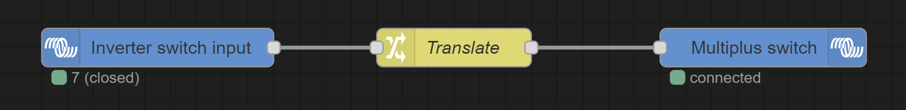
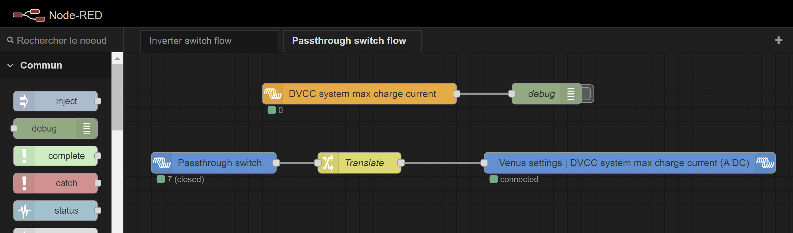
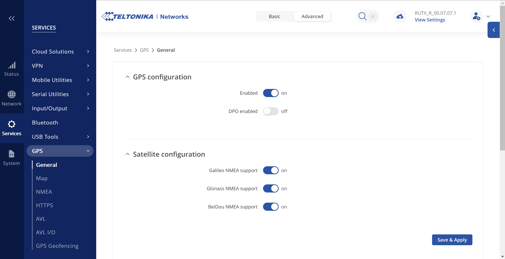
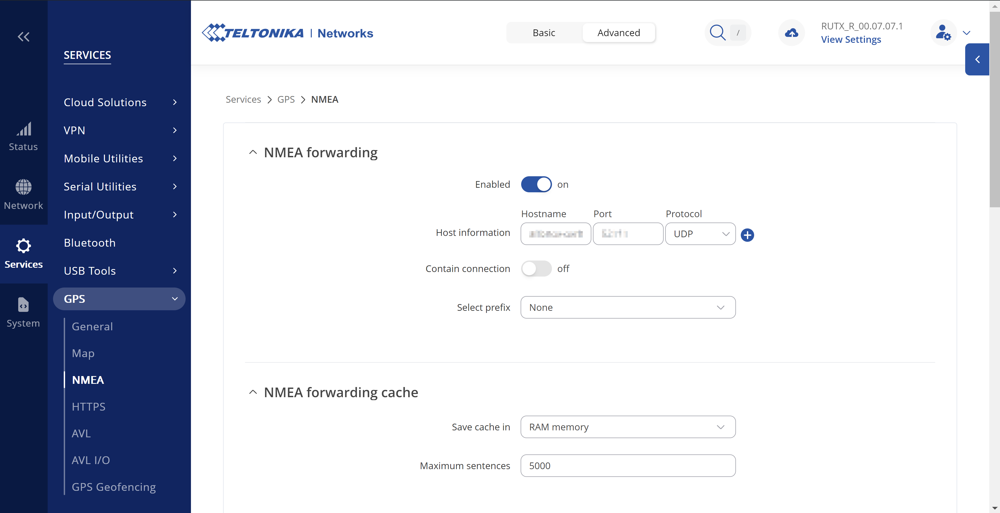

# venus-os-configuration

Various custom configuration for Venus OS based devices.

* [Multiplus inverter switch](#multiplus-inverter-switch)
* [Multiplus passthrough switch](#multiplus-passthrough-switch)
* [Stream Teltonika RUTX GPS data to a GX device](#stream-teltonika-rutx-gps-data-to-a-gx-device)

## Multiplus inverter switch

This configuration lets you change your Multiplus device *Switch* state (on/off/charger only/inverter only) with a physical switch.

### Plug a switch

Follow the [switch configuration page](docs/Venus-OS_Configure-switch.md) to add a switch named *Inverter_switch*.

### Node-RED Inverter switch flow

[Access Node RED](docs/Venus-OS_Access_Node-RED.md) and import [Inverter switch flow](nodered/NodeRED-Inverter_switch_flow.json) :

The *Translate* node translates the switch value into the desired Multiplus *Switch* value.
By default, it is :

| Inverter switch value    | Multiplus switch value |
|--------------------------|------------------------|
| 6 (open = off position)  | 3 (On)                 |
| 7 (closed = on position) | 1 (Charger only)       |

Double click on the *Multiplus switch* node for the allowed values. Change the *Translate* node as desired.

## Multiplus passthrough switch

This configuration sets the *DVCC Limit charge current* to unlimited or 0A based with a physical switch.

### Configure the passthrough switch

Follow the [switch configuration page](docs/Venus-OS_Configure-switch.md) to add a switch named *Passthrough_switch*.

### Node-RED Passthrough switch flow

[Access Node RED](docs/Venus-OS_Access_Node-RED.md) and import [Passthrough switch flow](nodered/NodeRED-Passthrough_switch_flow.json) :

The *Translate* node translates the switch value into the desired *DVCC Limit charge current* value.
By default, it is :

| Passthrough switch value | DVCC Limit charge current value |
|--------------------------|---------------------------------|
| 6 (open = off position)  | -1 (Unlimited)                  |
| 7 (closed = on position) | 0  (0A)                         |

## Stream Teltonika RUTX GPS data to a GX device

### RUTX configuration

In RUTX web UI, go to *Services* -> *GPS* -> *General* and enable GPS :

Go to *Services* -> *GPS* -> *NMEA* to enable and configure NMEA.
In *Host information*, set the hostname of your GX device, change the default port if you like and set UDP protocol :

### Venus OS configuration

Deploy script [/data/rc.local](./shell/data/rc.local) :

- If the file does not exist yet, copy the script and give it 755 rights
- If the file already exists, append the content of the script

If you have changed the default port in RUTX configuration, change it in the first line of the script.

Restart the GX device.
