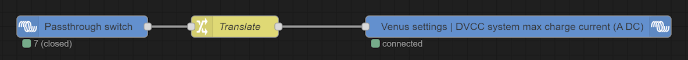

# Venus OS configuration

Various custom configuration for Venus OS based devices.

<!-- TOC -->
* [Node-RED flows](#node-red-flows)
  * [Multiplus inverter switch](#multiplus-inverter-switch)
  * [Multiplus passthrough switch](#multiplus-passthrough-switch)
* [Stream Teltonika RUTX GPS data to a GX device](#stream-teltonika-rutx-gps-data-to-a-gx-device)
  * [RUTX configuration](#rutx-configuration)
  * [GX device configuration](#gx-device-configuration)
* [Replace self-signed Victron SSL certificate](#replace-self-signed-victron-ssl-certificate)
* [Add root CA](#add-root-ca)
<!-- TOC -->

## Node-RED flows

### Multiplus inverter switch

This configuration lets you change your Multiplus device *Switch* state (on/off/charger only/inverter only) with a physical switch.

#### Plug a switch

Follow the [switch configuration page](docs/Venus-OS_Configure-switch.md) to add a switch named *Inverter_switch*.

#### Inverter switch flow

[Access Node RED](docs/Venus-OS_Access_Node-RED.md) and import [Inverter switch flow](nodered/NodeRED-Inverter_switch_flow.json) :


The *Translate* node translates the switch value into the desired Multiplus *Switch* value.
By default, it is :

| Inverter switch value    | Multiplus switch value |
|--------------------------|------------------------|
| 6 (open = off position)  | 3 (On)                 |
| 7 (closed = on position) | 1 (Charger only)       |

Double-click on the *Multiplus switch* node for the allowed values. Change the *Translate* node as desired.

### Multiplus passthrough switch

This configuration sets the *DVCC Limit charge current* to unlimited or 0A based with a physical switch.

#### Configure the passthrough switch

Follow the [switch configuration page](docs/Venus-OS_Configure-switch.md) to add a switch named *Passthrough_switch*.

#### Node-RED Passthrough switch flow

[Access Node RED](docs/Venus-OS_Access_Node-RED.md) and import [Passthrough switch flow](nodered/NodeRED-Passthrough_switch_flow.json) :



The *Translate* node translates the switch value into the desired *DVCC Limit charge current* value.
By default, it is :

| Passthrough switch value | DVCC Limit charge current value |
|--------------------------|---------------------------------|
| 6 (open = off position)  | -1 (Unlimited)                  |
| 7 (closed = on position) | 0  (0A)                         |

## Stream Teltonika RUTX GPS data to a GX device

### RUTX configuration

In RUTX web UI, go to *Services* -> *GPS* -> *General* and enable GPS :


Go to *Services* -> *GPS* -> *NMEA* to enable and configure NMEA.
In *Host information*, set the hostname of your GX device, change the default port if you like and set UDP protocol :


### GX device configuration

Deploy script [/data/rc.local](./shell/data/rc.local) :

- If the file does not exist yet, copy the script and give it 755 rights
- If the file already exists, append the content of the script

If you have changed the default port in RUTX configuration, change it in the first line of the script.

Restart the GX device.

## Replace self-signed Victron SSL certificate

### Copy your certificate

After generating a certificate, copy it and its private key to `/data/etc/ssl` then :

``` bash
    chmod 644 /data/etc/ssl/your-cert.pem
    chmod 400 /data/etc/ssl/your-cert-key.pem
```

### Update SSL configuration

| Tool     | File                                  | Before                                                                                                                                                                                      | After                                                                                                                                                                                                    |
|----------|---------------------------------------|---------------------------------------------------------------------------------------------------------------------------------------------------------------------------------------------|----------------------------------------------------------------------------------------------------------------------------------------------------------------------------------------------------------|
| NGinx    | /etc/nginx/sites-available/https.site | server {<br />&emsp;listen 443 ssl;<br />&emsp;listen [::]:443 ssl;<br />&emsp;ssl_certificate /data/etc/ssl/venus.local.crt;<br />&emsp;ssl_certificate_key /data/etc/ssl/venus.local.key; | server {<br />&emsp;listen 443 ssl;<br />&emsp;listen [::]:443 ssl;<br />&emsp;ssl_certificate /data/etc/ssl/your-cert.pem;<br />&emsp;ssl_certificate_key /data/etc/ssl/your-cert-key.pem; |
| Node-RED | /etc/nginx/sites-available/node-red   | server {<br />&emsp;listen 1881 ssl;<br />&emsp;server_name _;<br />&emsp;ssl_certificate /data/etc/ssl/venus.local.crt;<br />&emsp;ssl_certificate_key /data/etc/ssl/venus.local.key;      | server {<br />&emsp;listen 1881 ssl;<br />&emsp;server_name _;<br />&emsp;ssl_certificate /data/etc/ssl/your-cert.pem;<br />&emsp;ssl_certificate_key /data/etc/ssl/your-cert-key.pem;      |
| FlashMQ  | /etc/flashmq/flashmq.conf             | listen {<br />&emsp;protocol mqtt<br />&emsp;port 8883<br />&emsp;fullchain /data/keys/mosquitto.crt<br />&emsp;privkey /data/keys/mosquitto.key<br />}                                     | listen {<br />&emsp;protocol mqtt<br />&emsp;port 8883<br />&emsp;fullchain /data/etc/ssl/your-cert.pem<br />&emsp;privkey /data/etc/ssl/your-cert-key.pem<br />}                           |

> **_NOTE:_**  Those configuration file are not in the `/data` folder, hence they will be overwritten by Venus OS updates.

### Reboot

``` bash
    reboot
```

## Add root CA

Append your new root CA to `/etc/ssl/certs/ca-certificates.crt`.

> **_NOTE:_**  This configuration file is not in the `/data` folder, hence it will be overwritten by Venus OS updates.
