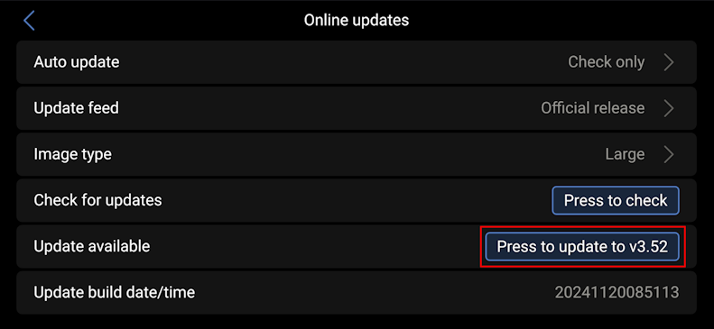

# Reset Venus OS

Maybe you have installed a bunch of packages, maybe you have deleted or modified a file you should not have.
Whatever the reason, you can reset everything very simply. 

Load previous firmware version by going in *Settings* -> *Firmware* -> *Stored backup firmware* -> *Press to boot* to load the N-1 version of Venus OS :

Launch the update process to version N from menu *Settings* -> *Firmware* -> *Online updates* :
- If needed, click *Press to check* to get latest firmware :

- Click *Press to update to vM.mm* to trigger the update :

> **_NOTE:_**  After the update, everything on your device is reset, except the `/data` folder. If you have cleaning to do there, do it manually. If you had configured drivers, certificates or anything, do it again.