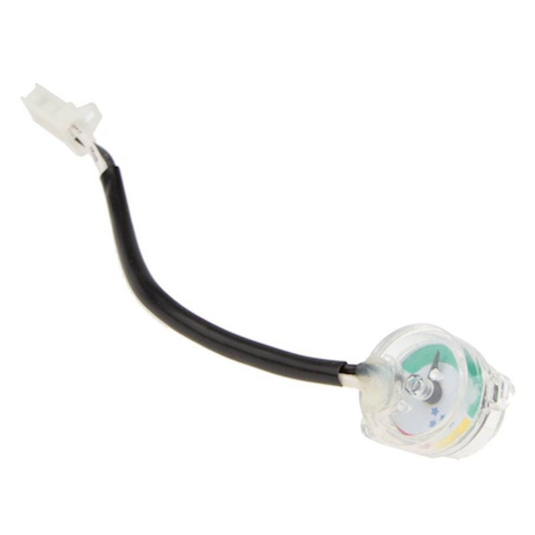
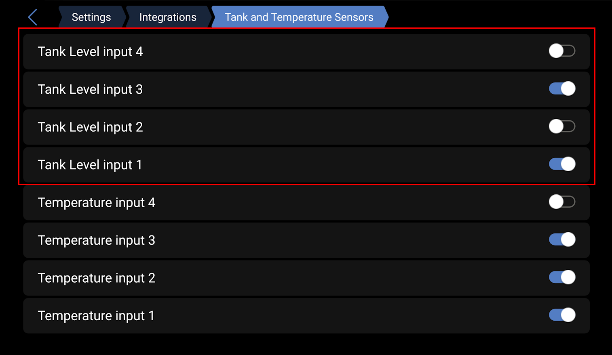
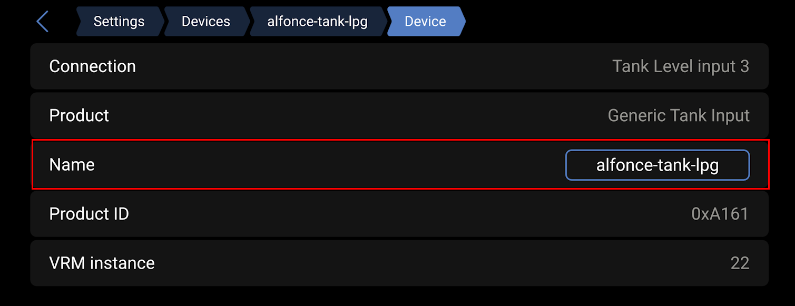
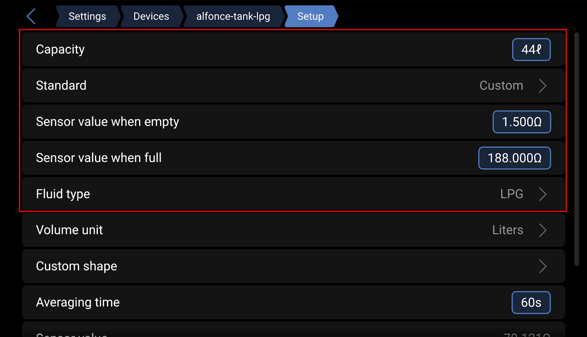

# LPG cable resistive manometer installation

To get accurate LPG tanks level information on your GX device, you can find resistive cable manometers that replace default tank manometers. They are sold under the brand Livello or Rotarex and looks like this :

The sensors are sending resistive information, from 0 to 90 ohms that you can test using a magnet to move the level indicator :

If you have one bottle, plug the sensor in one of the *Tank* inputs. If you have two bottles, put the sensor wires in serie and plug the two remaining wires in one of the input.

Activate the choosen *Tank* input in menu *Settings* -> *Integrations* -> *Tank and Temperature Sensors* :

Then in *Settings* -> *Devices* -> *Fuel Tank* (or other default name) -> *Device* submenu :

Finally, configure the sensor in *Settings* -> *Devices* -> Sensor name -> *Setup* :
- Enter bottle(s) capacity
- Set *Standard* to *Custom*
- Set *Sensor value when empty* and *Sensor value when full* to 0, 90, 180 or any measured values
- Set *Fluid type* to LPG

Refer to [official documentation](https://www.victronenergy.com/media/pg/Cerbo_GX/fr/connecting-supported-non-victron-products.html#UUID-5b2274ef-2d48-567e-7680-efecc9a33bce) for additional information