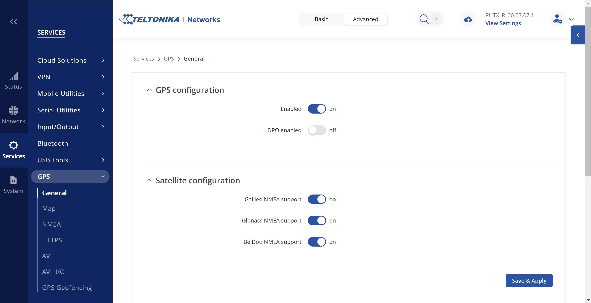

# Stream GPS data to a Venus OS device

If you have a network device with GPS ability, instead of buying a GPS hardware,
you can stream GPS data to your Venus OS device.

## Source configuration

Here, we shall create a UDP NMEA stream to the Venus OS device. As an example, here is the configuration for a RUTX device.

In RUTX web UI, go to *Services* -> *GPS* -> *General* and enable GPS :



Go to *Services* -> *GPS* -> *NMEA* to enable and configure NMEA.
In *Host information*, set the hostname of your GX device, choose UDP protocol and set a port, i.e. 8500 :


## GX device configuration

Create or append the file [`/data/rc.local`](../shell/data/rc.local) on your Venus OS device with :

``` bash
  # Configure as you wish
  UDPGPS_PORT=8500
  UDPGPS_NAME='UDP GPS'
  
  # Start background socat process to transfert data from UDP port 8500 to /dev/ttyUDPGPS device terminal file
  /usr/bin/socat UDP4-RECV:"$UDPGPS_PORT" pty,link=/dev/ttyUDPGPS,raw,nonblock,echo=0,b115200 &
  
  # Crazy background loop : relaunching gps_dbus command until it is successful
  while [ "$(pgrep gps_dbus | wc -l)" -eq 0 ]
  do
    sleep 1
    # Start a gps_dbus deamon process that reads the device terminal file fed by socat
    /opt/victronenergy/gps-dbus/gps_dbus -s /dev/ttyUDPGPS -b 115200 -t 0
  done &
  
  # Create background process
  (
    # Wait until the gps_dbus device is available
    while [ "$(dbus -y | grep -c ve_ttyUDPGPS)" -eq 0 ]
    do
      sleep 1
    done
  
    # Name the device created by gps_dbus process
    dbus -y com.victronenergy.gps.ve_ttyUDPGPS /ProductName SetValue "$UDPGPS_NAME" > /dev/null
  )&
   
  exit 0
```

> **_NOTE:_**  UDPGPS_PORT is the name that you will see in *Settings* -> *GPS* menu. UDPGPS_PORT is the port number you chose during source configuration. 

If needed, give execution rights to the script file with `chmod 755 /data/rc.local`.

Restart the GX device with `reboot` command.
