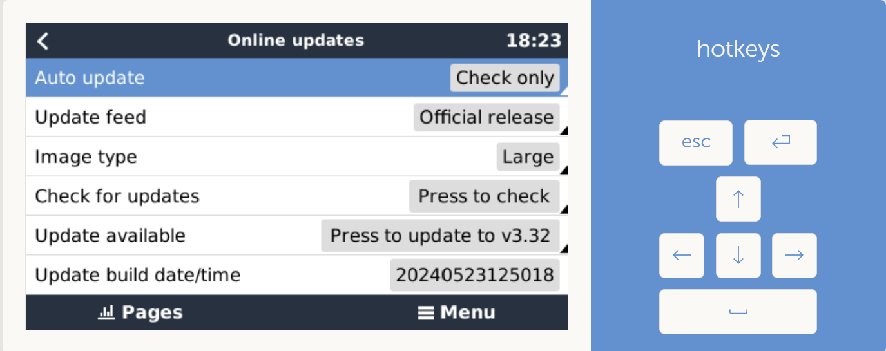
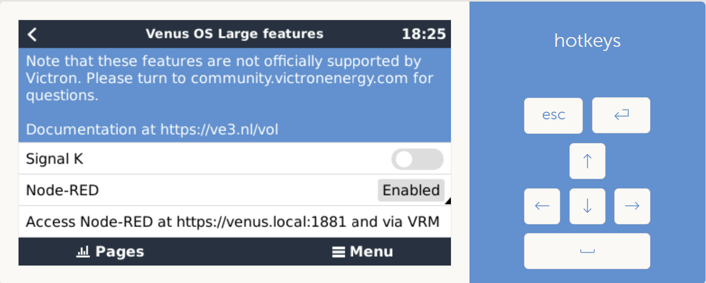

# Access Node RED

Go to *Settings* -> *Firmware* -> *Online updates*, if needed set *Image type* to *Large* and start an update :

Go to *Settings* -> *Venus OS Large features*, if needed enable *Node-RED* :

Go to https://venus.local:1881 (use local IP address if needed).
If prompted for login, user is *admin*, the password is the one you have configured in *Settings* -> *General* -> *Set root password*.
